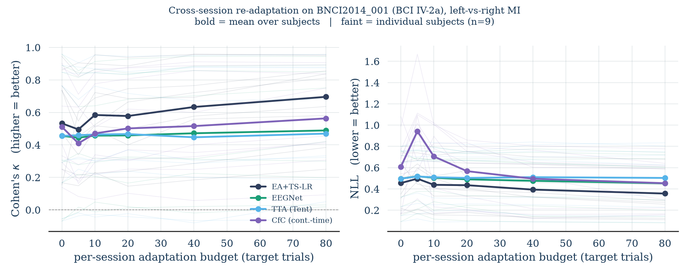

# Adaptation-Efficient Cross-Session BCI — A Diagnostic Benchmark

A small, reproducible benchmark that measures **cross-session re-adaptation efficiency** — how little
target-session data a decoder needs to recover after day-to-day drift — rather than peak within-session
accuracy, for motor-imagery EEG. All methods are evaluated under a strict **no-leakage** protocol on
public data (BNCI2014_001 / BCI Competition IV-2a: 9 subjects, 2 sessions, 22 channels, left-vs-right-hand
motor imagery).



**Left:** accuracy recovery (Cohen's κ, higher is better). **Right:** calibration recovery (negative
log-likelihood, lower is better). Bold lines are the mean over 9 subjects; faint lines are individual
subjects. The x-axis is the number of target-session trials used to adapt after cross-session drift
(labeled for the supervised methods; unlabeled for test-time adaptation).

## Why this benchmark

Wearable BCIs degrade across sessions because both the neural source and the measurement pathway
(electrode contact, placement, posture, attention, fatigue) change between days. In deployment, the
practical bottleneck is not peak accuracy in one calibrated session but **how quickly a decoder
re-adapts** with minimal new data. This benchmark isolates that question and, importantly, decomposes
"recovery" into separate **accuracy** and **calibration** axes.

## Key observations (this figure)

- **Adaptation efficiency and peak accuracy are dissociable.** No single decoder dominates across all
  adaptation budgets. The classical alignment baseline (Euclidean Alignment + tangent-space logistic
  regression) has both the highest zero-budget accuracy floor and the steepest recovery slope; the
  compact deep decoders adapt differently and less steeply in this small-data regime.
- **Accuracy and calibration can come apart under drift.** At very small adaptation budgets, a decoder
  can show only a small accuracy drop while its NLL spikes sharply — i.e. it becomes *confidently wrong*.
  This failure is invisible to an accuracy-only metric, which is exactly why recovery is reported on two
  axes here.
- **Large inter-subject variance.** Individual-subject curves span from near-ceiling to near-chance,
  consistent with the well-documented "BCI inefficiency" phenomenon.

## Methods compared

| Method | Family | Adaptation signal |
|---|---|---|
| EA + TS-LR | classical / Riemannian | labeled (re-estimated alignment + retrained classifier) |
| EEGNet | compact CNN | labeled fine-tune |
| TTA (Tent) | test-time adaptation | **unlabeled** (BatchNorm statistics + entropy minimization) |
| CfC | continuous-time recurrent | labeled fine-tune |

## No-leakage protocol

The source session is used in full. The target session is split into the first *d* trials (the adaptation
budget) and a held-out remainder (the test set). Every alignment matrix, normalization statistic, and
classifier parameter is fit on source (+ adaptation) data only; the held-out target remainder is never
seen during adaptation. Filtering and normalization are causal / source-fitted.

## Honest caveats

- **Single dataset, 2-class, small-data regime** (~144 trials/session). Rankings may not transfer to
  other datasets or paradigms.
- **CfC's absolute placement is sensitive to the readout choice** (last-step vs. mean-pool over time).
  This benchmark is a *diagnostic* of the accuracy / calibration / efficiency axes, **not** a claim that
  any single architecture is superior.
- **TTA uses a deliberately conservative Tent recipe** (BatchNorm-affine parameters + a few
  entropy-minimization steps). Stronger EA-aligned online TTA variants are left as future work.
- Deep models use a simple fine-tuning recipe and are **not** tuned for peak accuracy.

## Reproduce

Requires Python 3.10+ and an Apple-Silicon (MPS) or CPU machine.

```bash
python3 -m venv demo && source demo/bin/activate
pip install -r requirements.txt

python moabb_cross_session_adaptation.py        # full benchmark, all 9 subjects
python moabb_cross_session_adaptation.py 1 2    # quick test on subjects 1 and 2
python moabb_cross_session_adaptation.py plot   # re-plot from cached results.pkl (no recompute)
```

The dataset is downloaded automatically by MOABB on first run and cached locally.

## Data & references

Dataset: BNCI2014_001 (BCI Competition IV-2a), accessed via the MOABB benchmarking framework.

- M. Tangermann et al., "Review of the BCI Competition IV," *Frontiers in Neuroscience*, 2012 (dataset).
- V. Jayaram & A. Barachant, "MOABB: trustworthy algorithm benchmarking for BCIs," *J. Neural Eng.*, 2018.
- V. Lawhern et al., "EEGNet: a compact convolutional neural network for EEG-based BCIs," *J. Neural Eng.*, 2018.
- H. He & D. Wu, "Transfer Learning for Brain–Computer Interfaces: A Euclidean Space Data Alignment Approach," *IEEE TBME*, 2020.
- A. Barachant et al., "Multiclass Brain–Computer Interface Classification by Riemannian Geometry," *IEEE TBME*, 2012 (tangent-space classification; via the pyriemann library).
- D. Wang et al., "Tent: Fully Test-Time Adaptation by Entropy Minimization," *ICLR*, 2021.
- R. Hasani et al., "Closed-form continuous-time neural networks," *Nature Machine Intelligence*, 2022 (CfC; via the ncps library).

---

*Preliminary work by Shang-Wei (Jerry) Hung. Independent research toward adaptation-efficient,
uncertainty-aware non-invasive BCI. Feedback welcome.*
